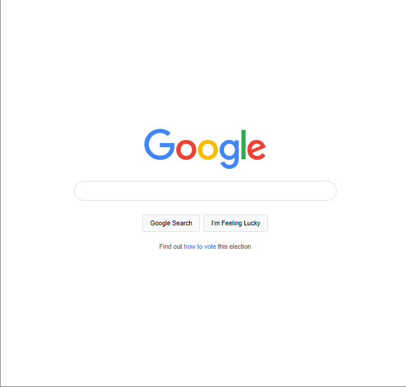

# Google Clone

This project is a simple clone of the Google homepage. It includes a search bar, buttons, and a clean, minimalist design inspired by Google's classic look. The page is responsive and styled using CSS, with a focus on simplicity and user-friendliness.

## Table of Contents
- [Live Demo](#live-demo)
- [Screenshot](#screenshot)
- [Features](#features)
- [Technologies Used](#technologies-used)

## Live Demo
Check out the live demo of this project: [Google Clone Demo](https://scrimba-horatio-google-clone.netlify.app/)

## Screenshot

## Features
- Google-like minimalist homepage design.
- Responsive layout for desktop and mobile devices.
- Functional search bar (without backend search functionality).
- Simple and clean buttons styled similarly to Google’s "Google Search" and "I'm Feeling Lucky."

## Technologies Used
- **HTML5** for markup structure.
- **CSS3** for styling, including CSS variables for consistency in design.
- **JavaScript** (optional) for any future interactive elements.
- **Netlify** (or any other platform) for hosting the live demo.

